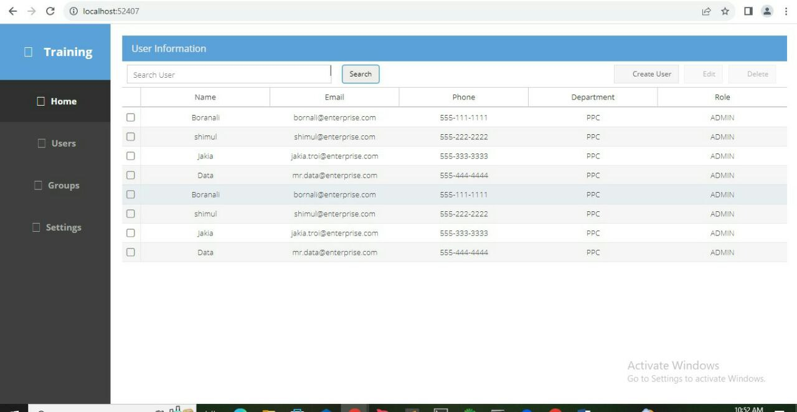

## 📝Practical

### hw-01

Task Details:
- Create a grid and add more columns.
- keep data in the grid.
- Create a tbar and add a search bar, Create, update & delete or refresh button.
- Implement checkbox in the grid and necessary logic for it. (Disable and enable button logic after checked the checkbox.)