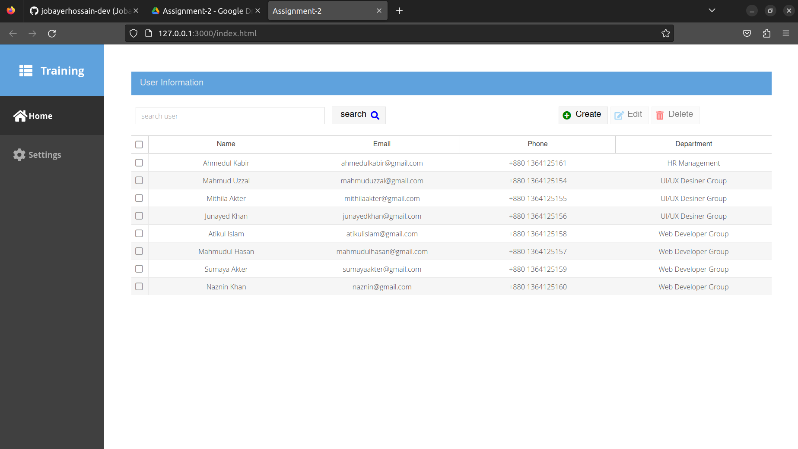

# 📝Practical

Home work submission [link](https://drive.google.com/drive/folders/1-0Ox1-NzdJCMls2zIyvVtCksUk6wNldx?fbclid=IwAR1qqBQSmNb-W1cQKvIRbWcnI6-iuYEevBCuX8pvGUVr-YtvX-ABzdAGXlc)
## hw-01

Task Details:
- Install Ext JS in your computer.
- Take a screenshort to submit as a home work.

## hw-02

Task Details:
- Create a grid and add more columns.
- keep custom data in the grid.
- Add checkboks with enable and disable logic.
- Create a tbar with a search bar and add buttons(Create, update & delete).
- Add icon in the buttons.
- Submit it as homework to upload a .zip file.